# 🎓 BÀI TẬP LỚN CÁ NHÂN MÔN TRÍ TUỆ NHÂN TẠO
## Bài toán 8 Quân Hậu - 17 Thuật toán AI

**Sinh viên thực hiện:** Phạm Đăng Quang

**MSSV:** 23110143 

**Lớp:** 251ARIN330585_04CLC

**Môn học:** Trí tuệ nhân tạo

**Giảng viên:** Phan Thị Huyền Trang

---

## 📋 THÔNG TIN BÀI TẬP

### Yêu cầu đề bài:
Triển khai bài toán 8 quân hậu sử dụng 17 thuật toán AI khác nhau bao gồm:
- Tìm kiếm không có thông tin
- Tìm kiếm có thông tin  
- Thỏa mãn ràng buộc
- Tìm kiếm cục bộ
- Tìm kiếm trong môi trường phức tạp

### Mục tiêu bài toán:
Đặt 8 quân hậu trên bàn cờ 8x8 sao cho không có quân nào tấn công được quân nào khác. Quân hậu di chuyển theo hàng ngang và hàng dọc và đường chéo.

## 🎮 CÁCH CHẠY CHƯƠNG TRÌNH

- Chạy chương trình trong visual studio code
- Nhấn vào các nút thuật toán để chạy thuật toán tương ứng
- Bấm tăng tốc để tăng tốc độ thuật toán và bấm lại lần nữa để giảm tốc độ 
---

## 📊 17 THUẬT TOÁN ĐÃ TRIỂN KHAI

### 🔍 TÌM KIẾM KHÔNG CÓ THÔNG TIN

| STT | Thuật toán | Mô tả | Demo |
|-----|------------|-------|------|
| 1 | **BFS** - Breadth-First Search | Tìm kiếm theo chiều rộng | 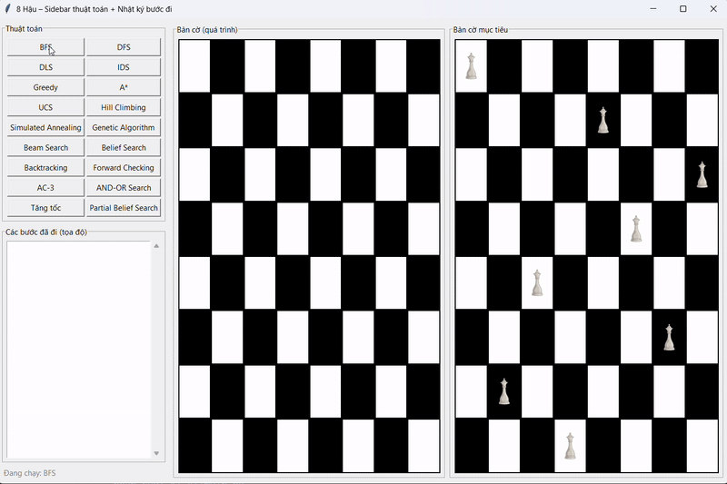 |
| 2 | **DFS** - Depth-First Search | Tìm kiếm theo chiều sâu | 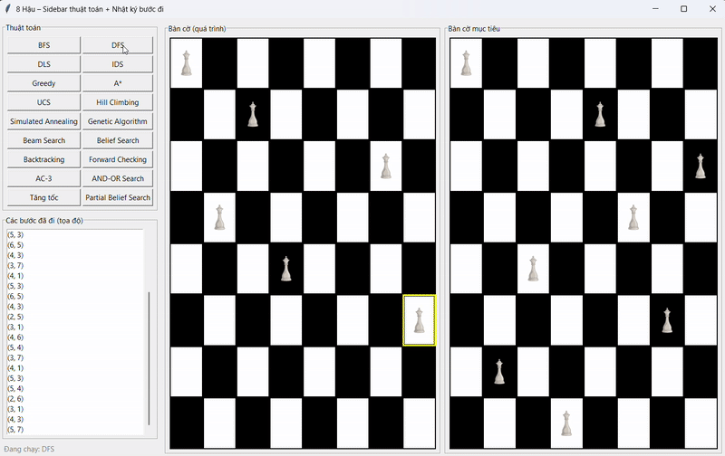 |
| 3 | **IDS** - Iterative Deepening Search | Tìm kiếm sâu dần | 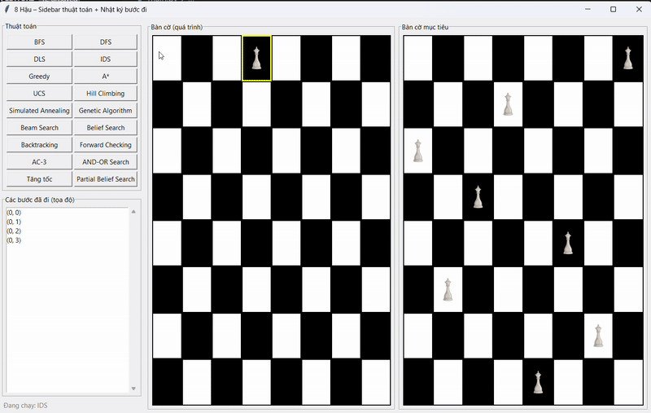 |
| 4 | **DLS** - Depth-Limited Search | Tìm kiếm theo chiều sâu có giới hạn độ sâu | 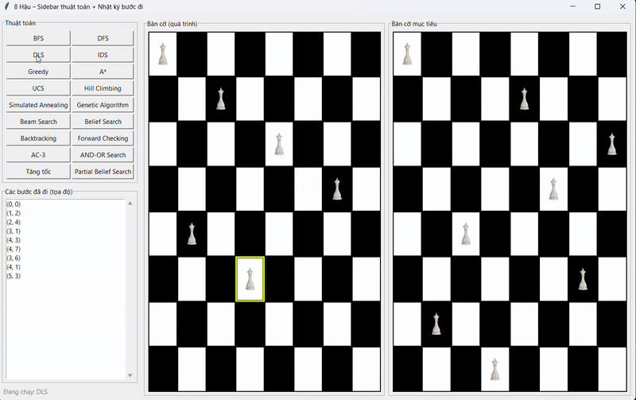 |

### 🎯 TÌM KIẾM CÓ THÔNG TIN

| STT | Thuật toán | Mô tả | Demo |
|-----|------------|-------|------|
| 5 | **UCS** - Uniform Cost Search | Tối ưu cost | 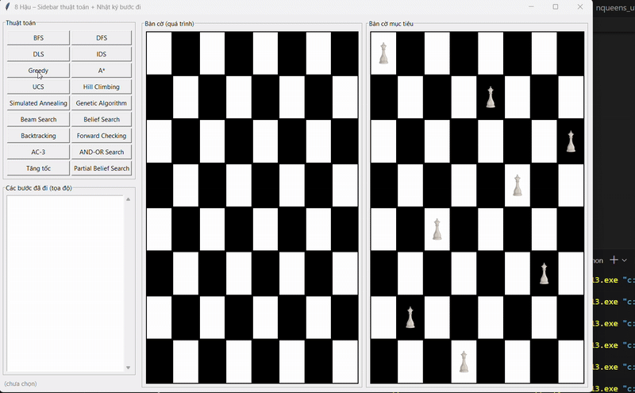 |
| 6 | **Greedy** - Greedy Best-First | Tham lam theo heuristic |  |
| 7 | **A*** - A-star Search | Tối ưu với heuristic | 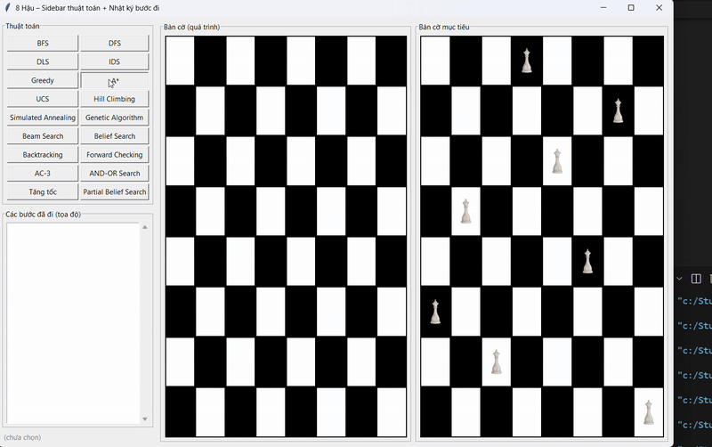 |

### 🔒 THỎA MÃN RÀNG BUỘC (CSP)

| STT | Thuật toán | Mô tả | Demo |
|-----|------------|-------|------|
| 8 | **Backtracking** | Quay lui cơ bản | 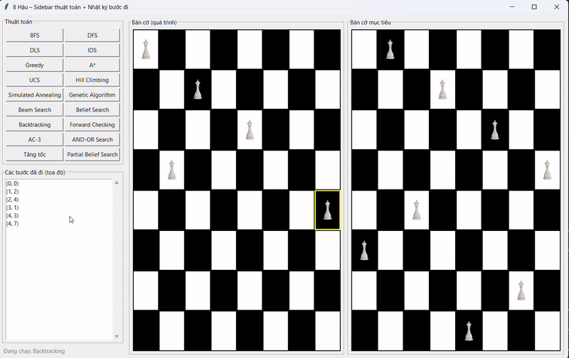 |
| 9 | **Forward Checking** | Kiểm tra tiến | 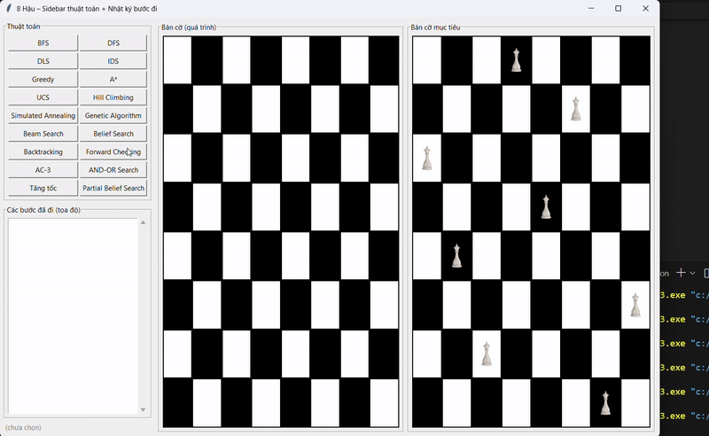 |
| 10 | **AC-3** - Arc Consistency | Tính nhất quán cung | 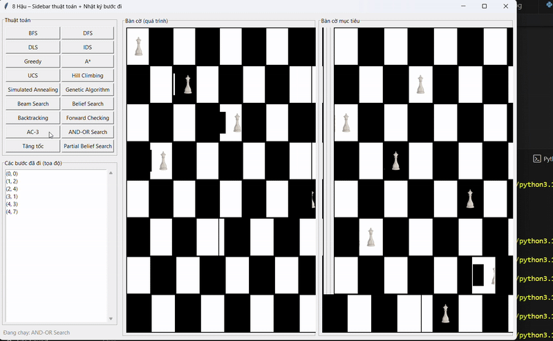 |

### 🏔️ TÌM KIẾM CỤC BỘ

| STT | Thuật toán | Mô tả | Demo |
|-----|------------|-------|------|
| 11 | **Hill Climbing** | Leo đồi | 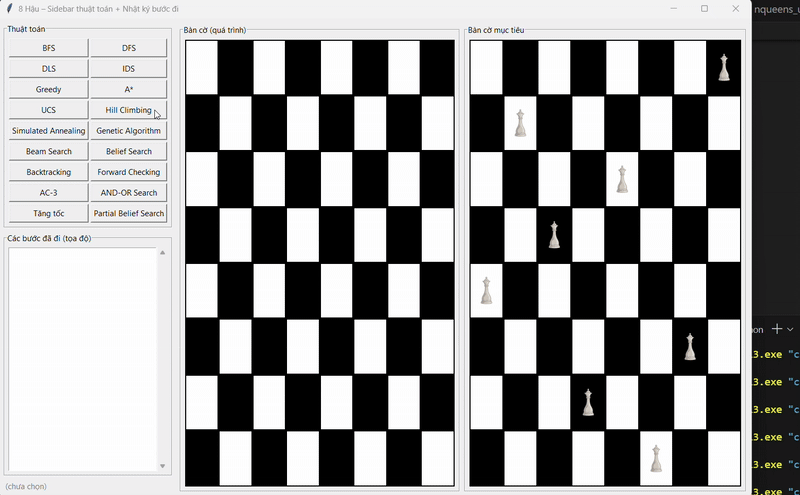 |
| 12 | **Simulated Annealing** | Luyện kim mô phỏng | 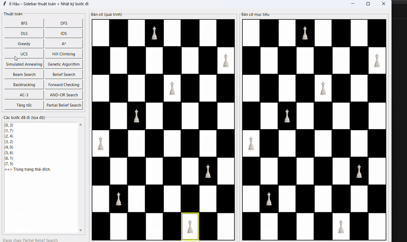 |
| 13 | **Beam Search** | Tìm kiếm chùm | 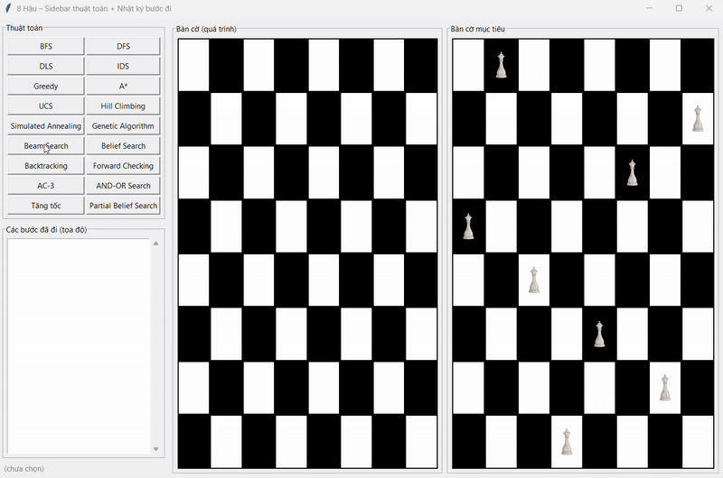 |
| 14 | **Genetic Algorithm** | Thuật toán di truyền |  |

### 🌳 TÌM KIẾM TRONG MÔI TRƯỜNG PHỨC TẠP

| STT | Thuật toán | Mô tả | Demo |
|-----|------------|-------|------|
| 15 | **AND-OR Search** | Tìm kiếm đồ thị AND-OR | 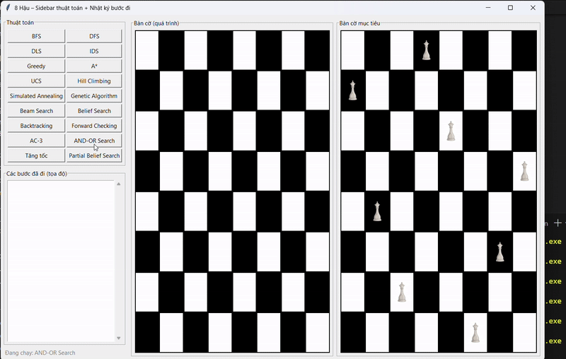 |
| 16 | **Belief State Search** | Tìm kiếm không nhìn thấy |  |
| 17 | **Partial Belief Search** | Tìm kiếm nhìn thấy một phần | 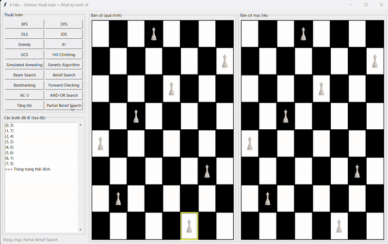 |

---

## 🎯 CÁCH KIỂM TRA BÀI TẬP

### Test cơ bản:
1. Chạy chương trình - Kiểm tra giao diện có hoạt động
2. Nhấn các nút thuật toán - Kiểm tra thuật toán có chạy
3. Nhấn nút tăng tốc để điều chỉnh tốc độ thuật toán theo ý muốn

### Test chi tiết:
1. Thử từng thuật toán riêng lẻ
2. Kiểm tra thông tin trong ô thông báo
3. Xem kết quả hiển thị có chính xác không
4. **Quan sát demo GIFs** - So sánh với kết quả thực tế

### Kết quả mong đợi:
- **Thành công**: Tìm được vị trí quân hậu không xung đột
- **Visual**: Giao diện giống như trong demo GIFs

## 🎨 VISUAL SHOWCASE

Bài tập này có **17 demo GIFs** cho thấy:
- 🧠 **17 thuật toán AI**: Mỗi thuật toán có demo riêng
- 🎯 **So sánh trực quan**: Thấy rõ sự khác biệt giữa các thuật toán

---

**Cảm ơn cô đã xem xét bài tập!**
